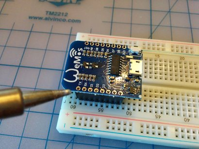

# Home Temperature Monitoring

The general idea of the project is to get a handle on how the house heats and cools so that we can better program the thermostat.

To gather data, I've assembled and programmed 5 probes using inexpensive hardware
([Wemos D1 Mini](https://wiki.wemos.cc/products:d1:d1_mini) ESP8266 WiFi boards and
[SHT30](https://wiki.wemos.cc/products:d1_mini_shields:sht30_shield) temperature/humidity sensors).
The probes send periodic reports to a web app that stashes away the data for later visualization and analysis.

Here are the project's lab notebooks.

* [A preliminary look at sensor data](InitialTemperatureValues.ipynb) after the first round of software
* [The foam core experiment](FoamCoreExperiment.ipynb) for getting more consistent sensor values
* [Moving the sensor away from the ESP8266](MovingTheSensor.ipynb) to see how much heat from the ESP8266 is throwing measurements off

